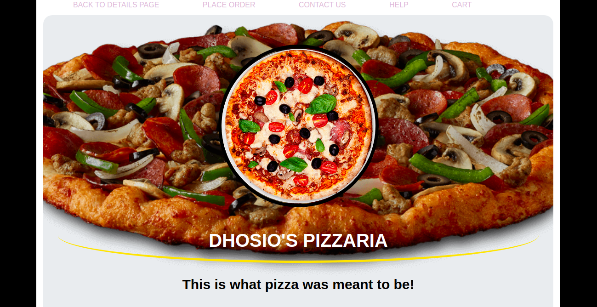

# Week 4 Independent Project
##### By Daniel Githiomi

#### Dhosio's Pizzaria is an interactive website that implements all the week's knowledge of the following areas; HTML, CSS and Java Script. It also incrporates my creative ability by addition of a few animations and transitions

##### Created By Daniel Githiomi

## Screenshots

  

## Description
Dhosio's Pizzaria is an enticing website that enticed the user to become part of the Dhosio's Pizzaria Community through its beautiful design that appeals to the eye of the user. This is a pizza website that allows the users order the number of pizza’s they need specify the nature of their ordered pizza,choose whether the order should be delivered or not, and see the prices for the orders.

## Setup/Installation Requirements
* i5 Core
* 6GB RAM
* 1TB Internal storage 

## Compatibility

  Compatible with all browsers.
  further updates on the way. 

## Technologies Used
It is made completly using sublime Text 3 where all the following files were created and modified until the output is as you see it.
* HTML 5
* CSS, Bootstrap
* Javascript
* JQuery

## Known Bugs
No bugs to report at the moment! the system works efficiently at 100% guaranteed. Feel free to search the output on googl to ensure that it coincides exactly.

## Link to live page
[This is my link to live pages] https://githiomi.github.io/Week-4-IP/

## Setup Instructions
git clone https://github.com/githiomi/Week-4-IP into your terminal. Navigate to the Week-4-IP folder through cd Documents/Desktop/moringa/Week-4-IP. Open the folder in your favourite editor,for vscode,is code . and for atom, atom . Open the index.html in your browser.

## Support and contact details
contact Daniel at:

* Email: danielgithiomi@gmail.com 0r

### License
Click the following to acces the license page: https://github.com/githiomi/license/blob/master/LICENSE

Copyright (c) {2020} Dhosio Co.